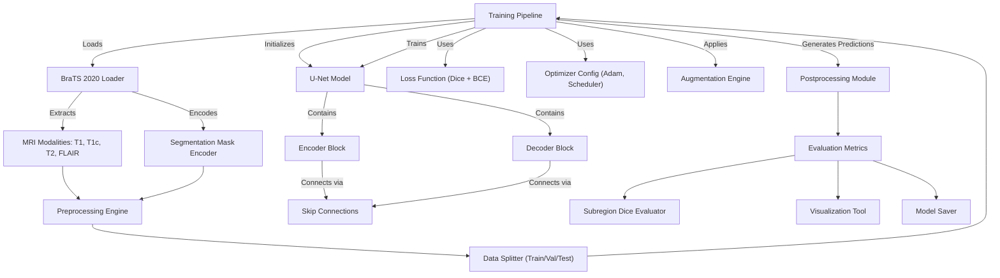

# Brain Tumor MRI Segmentation Using U-Net | Deep Learning for Medical Image

## Overview
A state-of-the-art deep learning pipeline using U-Net for precise brain tumor segmentation from MRI scans. Leveraging medical image processing, data augmentation, and TensorFlow/Keras, this project enables accurate detection of gliomas, meningiomas, and pituitary tumors—ideal for healthcare AI research and diagnostic automation.
 

|  |
|:--:|
| *Figure: Segmentation visualization demonstrating tumor region predictions across MRI slices in real-time.* |

 

## Objectives 
* Implement a U-Net architecture for pixel-wise brain tumor segmentation from MRI images ✅
* Preprocess DICOM/NIfTI datasets into clean, normalized NumPy arrays suitable for deep learning ✅
* Apply data augmentation techniques to improve model generalization on limited medical data ✅
* Train and validate the model using custom loss functions (Dice + Binary Crossentropy) ✅
* Evaluate performance using key metrics like Dice Score, IoU, and Precision-Recall ✅
* Generate and visualize high-resolution segmentation masks over MRI slices ✅
* Lay groundwork for real-time clinical deployment and research reproducibility ✅

## Dataset 
* Provided by the `Medical Image Computing and Computer Assisted Intervention (MICCAI)` society
* Consists of `multi-modal MRI scans`: T1, T1c, T2, and FLAIR for each subject
* Includes `annotated segmentation masks` for enhancing tumor (ET), tumor core (TC), and whole tumor (WT)
* Contains `3D volumetric scans` of glioblastomas (HGG) and lower-grade gliomas (LGG)
* Labels generated and verified by expert neuro-radiologists
* Data format: `NIfTI (.nii.gz)`, with voxel-level alignment across modalities
* Ideal for training deep learning models in `tumor detection, segmentation, and progression analysis`
* Publicly available for research via the `CBICA Image Processing Portal`

## Intuition
Traditional medical image segmentation models often treat tumor detection as a static classification or simple pixel-wise task. However, brain tumor segmentation is fundamentally a **spatially-aware localization problem**, where context across both image dimensions and modalities is crucial for accurate delineation.

 

|  |
|:--:|
| *Figure: The four imaging modalities provide distinct perspectives on the same brain image, each highlighting different features.* |

 

This project reframes tumor segmentation as a **structured image-to-image translation task**, where:
* The *input* is a stack of multimodal MRI slices (FLAIR, T1, T1c, T2) representing diverse anatomical and pathological cues
* The *output* is a pixel-level segmentation mask indicating tumor subregions: enhancing tumor (ET), tumor core (TC), and whole tumor (WT)
* The *objective* is to capture global brain structure while preserving local tumor boundaries

 

|  |
|:--:|
| *Figure: These insights are essential for accurate diagnosis, treatment planning, and monitoring. The segmentations help visualize the tumor clearly, making it easier to understand its characteristics and interactions with surrounding tissues.* |

 

These insights are essential for accurate diagnosis, treatment planning, and monitoring. The segmentations help visualize the tumor clearly, making it easier to understand its characteristics and interactions with surrounding tissues.

We implement a **U-Net architecture** because:
* The *encoder* captures high-level contextual features via downsampling
* The *decoder* reconstructs fine-grained boundaries using upsampling and skip connections
* *Skip connections* fuse semantic information with spatial precision, critical for medical segmentation tasks
* Together, they enable **precise, data-efficient learning** even with limited annotated medical data, ensuring robust tumor localization across patients and MRI modalities

 

<h3 align="center">Flow Chart: Component-Level Architecture – Brain Tumor Segmentation (U-Net)</h3>

## Results 
| Metric                  | Value    |
|-------------------------|----------|
| Loss                   | 0.0267   |
| Accuracy               | 0.9931   |
| Mean IoU               | 0.8426   |
| Dice Coefficient       | 0.6480   |
| Precision              | 0.9935   |
| Sensitivity (Recall)   | 0.9916   |
| Specificity            | 0.9978   |
| Dice Coef – Necrotic   | 0.5916   |
| Dice Coef – Edema      | 0.7667   |
| Dice Coef – Enhancing  | 0.7395   |

## References
- Research Paper: https://ieeexplore.ieee.org/document/10332149
- Dataset: https://www.med.upenn.edu/cbica/brats2020/data.html
